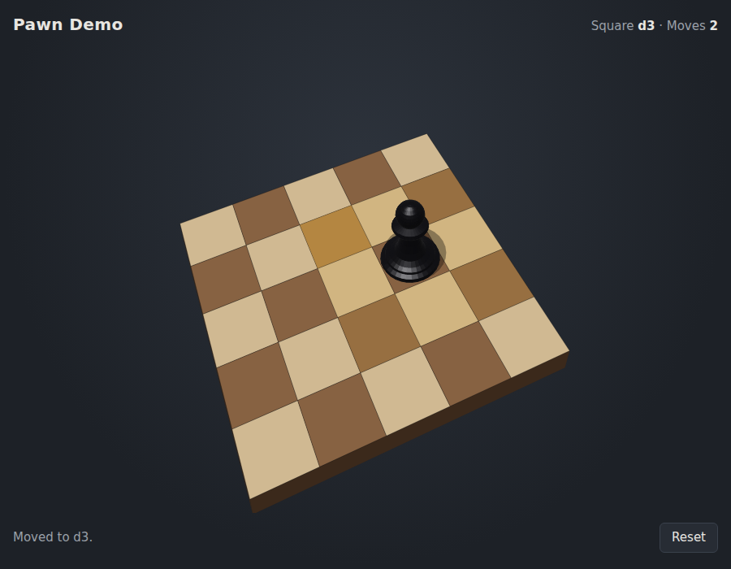

# Pawn Demo

A small Rust web server that serves a single page application. The page shows
a black 3D chess pawn standing on a tilted 5×5 board, and you move the pawn
one square at a time.



- **Random port.** The server picks a random port from 1001 to 65535 at
  startup and prints it to the terminal.
- **In-memory store.** There is no database. Each visitor's data is a
  `UserData` struct in a `HashMap` in memory. It is lost when the server stops,
  and sessions idle for more than an hour are removed.
- **64-bit session cookie.** On a visitor's first request the server sets a
  `pawn_sid` cookie (`HttpOnly`, `SameSite=Strict`). Its value is 64 bits from
  the operating system's cryptographic random number generator, shown as 16
  hex digits. The cookie is the key to that visitor's `UserData`.
- **AJAX, no WebSockets.** The page sends plain `fetch` requests. The server
  checks every move and returns the new state.
- **No external front-end libraries.** The 3D scene is drawn on a `<canvas>`
  by a small built-in renderer. The pawn is a solid of revolution with glossy
  shading. The page is compiled into the binary, so the program is a single
  self-contained executable.

## Project layout

```
Cargo.toml
src/main.rs         server, session store, API
static/index.html   single page application (embedded via include_str!)
```

## API

| Method | Path         | Body             | Response                                   |
|--------|--------------|------------------|--------------------------------------------|
| GET    | `/`          |                  | the single page application                |
| GET    | `/api/state` |                  | `{"x":2,"y":4,"moves":0,"size":5}`         |
| POST   | `/api/move`  | `{"x":3,"y":3}`  | new state, or `422` with `{error, state}`  |
| POST   | `/api/reset` |                  | the starting state                         |

`x` is the column (0–4, left to right) and `y` is the row (0 is the far,
uphill edge). A move is valid if the target is one square away in any
direction, diagonals included.

---

## Building (on Linux)

All builds are done on a Linux machine. These steps assume the Rust toolchain
(`rustup`, `cargo` and `rustc`, 1.85 or newer for edition 2024) is already
installed.

```bash
git clone <this repository> pawn-demo
cd pawn-demo
```

### Linux binary (native)

```bash
cargo build --release
```

The binary is written to `target/release/pawn_demo`.

### Windows binary (cross-compiled from Linux)

This uses Rust's `x86_64-pc-windows-gnu` target and the MinGW-w64 linker.

1. Add the Windows target to the Rust toolchain (one time):

   ```bash
   rustup target add x86_64-pc-windows-gnu
   ```

2. Install the MinGW-w64 cross linker (one time) with your distribution's
   package manager:

   ```bash
   sudo apt install gcc-mingw-w64-x86-64       # Debian / Ubuntu
   sudo dnf install mingw64-gcc                # Fedora
   sudo pacman -S mingw-w64-gcc                # Arch
   ```

   Check that it is on your `PATH`:

   ```bash
   x86_64-w64-mingw32-gcc --version
   ```

3. Build:

   ```bash
   cargo build --release --target x86_64-pc-windows-gnu
   ```

The Windows executable is written to
`target/x86_64-pc-windows-gnu/release/pawn_demo.exe`. Cargo finds the
`x86_64-w64-mingw32-gcc` linker automatically, so no extra configuration is
needed.

The `.exe` is self-contained. It only links against DLLs that ship with
Windows, so you copy that one file to the Windows machine and nothing else.

To check that it is really a Windows program:

```bash
file target/x86_64-pc-windows-gnu/release/pawn_demo.exe
# PE32+ executable (console) x86-64, for MS Windows
```

If Wine is installed, you can smoke-test the `.exe` on Linux with
`wine target/x86_64-pc-windows-gnu/release/pawn_demo.exe`. It prints its port
and serves the page just like the Linux build.

---

## Running and accessing the program

### Linux

```bash
./target/release/pawn_demo
# or build and run in one step:
cargo run --release
```

The terminal shows the port:

```
Pawn demo listening on port 24180
Open http://127.0.0.1:24180/ in your browser (Ctrl+C to stop)
```

Open the printed URL in any modern browser (Firefox, Chrome, and so on), for
example `http://127.0.0.1:24180/`. The port is different each time the server
starts. Press `Ctrl+C` in the terminal to stop the server.

### Windows

1. Copy `target/x86_64-pc-windows-gnu/release/pawn_demo.exe` to the Windows
   machine, for example with a USB stick, a network share, or `scp`.
2. Start it. Either
   - double-click `pawn_demo.exe`, which opens a console window showing the
     port, or
   - run it from PowerShell or Command Prompt in the folder you copied it to:

     ```powershell
     .\pawn_demo.exe
     ```

   The console shows the port and URL, for example:

   ```
   Pawn demo listening on port 24180
   Open http://127.0.0.1:24180/ in your browser (Ctrl+C to stop)
   ```

3. Open the printed URL in Edge, Chrome, or Firefox on the same Windows
   machine.

The server listens on localhost only by default, so Windows Firewall does not
prompt. Press `Ctrl+C` in the console window (or close it) to stop the
server.

The executable is not code-signed, so Windows may show a *"Windows protected
your PC"* SmartScreen warning when you start it. Click **More info**, then
**Run anyway**. If the file came from a download or a network share, you can
also right-click it, open **Properties**, and tick **Unblock**.

---

## Controls

- **Mouse:** click one of the highlighted squares next to the pawn.
- **Keyboard:** `↑ ↓ ← →` or `W A S D` move one square; `Q E Z C` move
  diagonally.
- **Reset:** puts the pawn back on its starting square and sets the move
  count to zero.

## Options

The server binds to `127.0.0.1` by default. To reach it from other machines on
your network, set `PAWN_BIND`:

```bash
PAWN_BIND=0.0.0.0 ./target/release/pawn_demo                # Linux
```

```powershell
$env:PAWN_BIND = "0.0.0.0"; .\pawn_demo.exe   # Windows PowerShell
```

Then browse to `http://<server-ip>:<port>/`. On Windows, allow the program
through the firewall when prompted. This is an alpha demo with no TLS, so only
expose it on networks you trust.

## Alternative: building natively on Windows

If you'd rather build on the Windows machine itself, first install the
[Visual Studio Build Tools](https://visualstudio.microsoft.com/visual-cpp-build-tools/)
with the *Desktop development with C++* workload, and install Rust from
<https://rustup.rs>. Then, in a new PowerShell window:

```powershell
cd pawn-demo
cargo build --release
.\target\release\pawn_demo.exe
```
